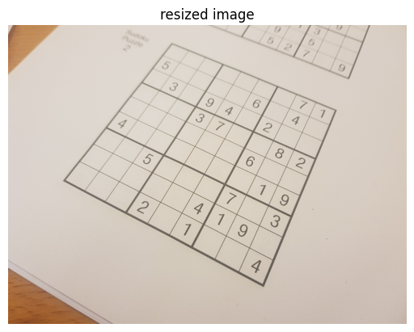

# sudoku-solver
Computer vision solution that finds a sudoku puzzle in a photo, extracts the puzzle grid, recognizes the numbers in the grid, finds the solution to the puzzle and projects it onto the original photo.

 

 

